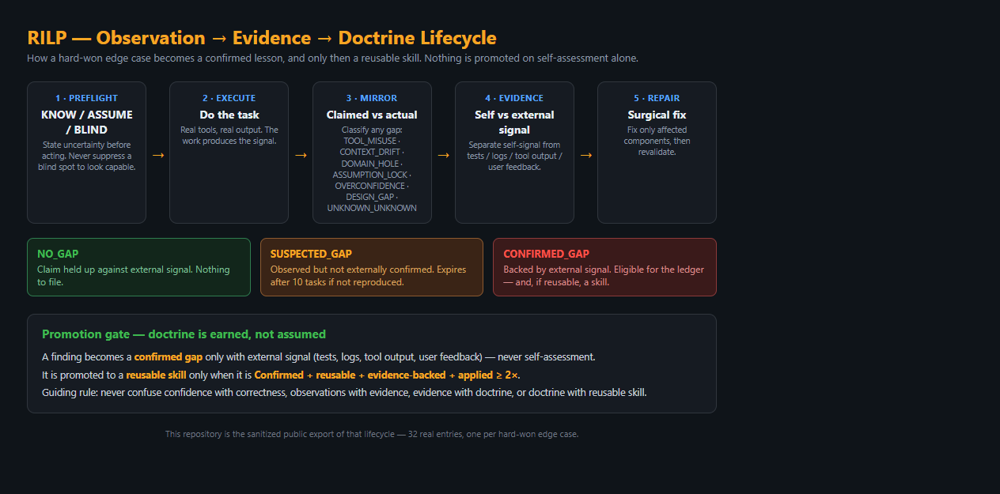

# RILP Ledger — edge cases & lessons learned

A public, continually-growing **ledger of hard-won edge cases, gaps, and confirmed
lessons** captured by the Recursive Intelligence Learning Protocol (RILP) during
real agent builds. Every entry is an actual failure or verified lesson — not
theoretical advice.

This repo is the *export* of the RILP self-audit twin. It is intentionally small
and dependency-free so it can be dropped into any project or read in 5 minutes.



*The lifecycle every entry passes through: a finding is only a **confirmed gap** with
external signal, and only becomes a **reusable skill** when Confirmed + reusable +
evidence-backed + applied ≥ 2×. This ledger is the sanitized public export of that process.*

## What's inside
- `ledger.jsonl` — canonical append-only ledger, one event per line (32 entries).
- `ledger.csv` — the same data as a spreadsheet for quick scanning.
- `sync_ledger.py` — regenerates the public ledger from the authoritative RILP
  store (OmniCRM `rilp` twin). **Reads only the `rilp` table — never touches
  contacts, projects, or any PII.** Sanitizes provider names/counts on export.
- `RILP_v1_FINAL.md` — the protocol spec the entries are filed against.
- `LICENSE` — MIT.

## Entry schema
```json
{
  "id": "rilp_20260723_996627",
  "kind": "gap | lesson_confirmed | event",
  "code": "stable_key",
  "ts": "2026-07-23T20:10:00Z",
  "note": "human-readable summary",
  "payload": { "symptom": "...", "fix": "...", "real_world_example": "...", "classification": "TOOL_MISUSE|CONTEXT_DRIFT|DOMAIN_HOLE|ASSUMPTION_LOCK|OVERCONFIDENCE|DESIGN_GAP|UNKNOWN_UNKNOWN" },
  "source": "buildgrid-ai build"
}
```

## Gap classification vocabulary (RILP)
`TOOL_MISUSE` · `CONTEXT_DRIFT` · `DOMAIN_HOLE` · `ASSUMPTION_LOCK` ·
`OVERCONFIDENCE` · `DESIGN_GAP` · `UNKNOWN_UNKNOWN`

## How entries are graded
Per RILP: an observation becomes a **confirmed gap** only with external signal
(tests, logs, tool output, user feedback) — never from self-assessment alone.
Promotion to a reusable skill requires: Confirmed + reusable + evidence-backed +
applied ≥ 2×.

## Sample lessons (from the build that produced this repo)
- **A\* hangs without a closed set** — linear open-set scan + no closed set can
  loop forever on real grids; verified because the test binary timed out. Fix:
  binary min-heap + `Uint8Array` closed set. (`astar_infinite_loop_missing_closed_set`)
- **A\* treats the exit as an obstacle** — blocking the goal cell makes egress
  pathfinding always fail. Exclude `exit-door` from the obstacle grid.
  (`astar_treats_exit_as_obstacle`)
- **A rule can be correct yet untriggerable** — NFPA's 75 ft radius exceeds a
  60×40 ft plan, so the rule can't fire there. Scale the test, don't "fix" the
  rule. (`rule_fires_only_on_large_enough_geometries`)
- **Green scaffold ≠ correct** — passing self-tests are self-signal, not evidence;
  audit scale/units/coverage before extending inherited code.
  (`scaffold_green_is_not_correctness`)
- **write_file can time out on large payloads** — keep per-call args under ~8K
  tokens; split or use `patch`. (`write_file_timeout_large_content`)
- **Ledger silence is a recurring gap** — logging must be mechanically enforced,
  not intended. (`rilp_ledger_silence_on_feature_work`)

## Project Status

**Maintained.** This is a live, append-only export that grows as new confirmed
lessons are captured during real agent builds. It is a documentation/data artifact,
not an application — there is nothing to "run" beyond `sync_ledger.py`, which
regenerates the public files from the authoritative store.

## Human and AI Contributions

**Ross's role:** originated RILP (the Recursive Intelligence Learning Protocol /
Dark-Mirror self-audit), defined what counts as evidence vs. self-signal, set the
promotion bar for turning a gap into a reusable skill, and directs what gets shared
publicly.

**AI-agent role:** applies the protocol during real builds, records each edge case
and confirmed lesson, and runs `sync_ledger.py` to produce this sanitized export.
Every entry corresponds to an actual failure or verified lesson — nothing here is
invented for illustration.

## License
MIT — free to use, fork, and extend. The lessons here are shared so the next
build starts where the last one ended.
